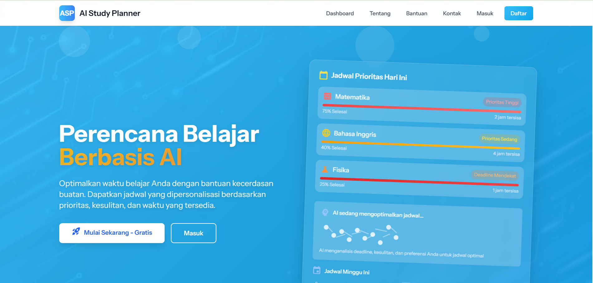

# AI Study Planner

AI Study Planner adalah aplikasi web berbasis Laravel yang membantu mahasiswa dan pelajar merencanakan jadwal studi mereka dengan bantuan kecerdasan buatan. Aplikasi ini menyediakan fitur perencanaan tugas, blok studi, pengingat otomatis, dan analitik performa studi.

## Fitur Utama

-   **Perencanaan Tugas AI-Powered**: Buat rencana studi otomatis berdasarkan tugas yang dimasukkan.
-   **Blok Studi**: Jadwalkan sesi studi dengan durasi dan waktu tertentu.
-   **Nudges (Pengingat)**: Sistem pengingat otomatis untuk motivasi dan pengingat tugas.
-   **Email Notifications**: Kirim email untuk penyelesaian tugas dan pengingat studi.
-   **Dashboard Analitik**: Lihat statistik mingguan, fokus waktu, dan progress tugas.
-   **Antarmuka Bahasa Indonesia**: Semua label dan pesan dalam bahasa Indonesia.
-   **Queue System**: Proses email dan tugas latar belakang menggunakan database queue.
-   **Responsive Design**: UI modern dengan Tailwind CSS.

## Persyaratan Sistem

-   **PHP**: ^8.2
-   **Composer**: Untuk dependency management PHP
-   **Node.js**: ^18.0 (untuk build assets)
-   **npm**: Untuk dependency frontend
-   **Database**: MySQL atau SQLite
-   **Web Server**: Apache/Nginx dengan mod_rewrite

## Dependencies

### PHP Dependencies (composer.json)

-   **laravel/framework**: ^12.0 - Framework utama Laravel
-   **laravel/tinker**: ^2.10.1 - REPL untuk Laravel
-   **fakerphp/faker**: ^1.23 - Generator data dummy (dev)
-   **laravel/pail**: ^1.2.2 - Dump server (dev)
-   **laravel/pint**: ^1.24 - Code style fixer (dev)
-   **laravel/sail**: ^1.41 - Docker development environment (dev)
-   **mockery/mockery**: ^1.6 - Mocking library untuk testing (dev)
-   **nunomaduro/collision**: ^8.6 - Error handling yang lebih baik (dev)
-   **phpunit/phpunit**: ^11.5.3 - Testing framework (dev)

### Frontend Dependencies (package.json)

-   **@tailwindcss/vite**: ^4.0.0 - Plugin Tailwind untuk Vite
-   **axios**: ^1.11.0 - HTTP client untuk AJAX requests
-   **concurrently**: ^9.0.1 - Menjalankan multiple commands secara paralel
-   **laravel-vite-plugin**: ^2.0.0 - Plugin Vite untuk Laravel
-   **tailwindcss**: ^4.0.0 - CSS framework utility-first
-   **vite**: ^7.0.7 - Build tool dan dev server

## Requirements Detail

### PHP Extensions Required

-   `pdo` - PHP Data Objects
-   `pdo_mysql` atau `pdo_sqlite` - Database drivers
-   `mbstring` - Multibyte string handling
-   `openssl` - OpenSSL support
-   `tokenizer` - PHP tokenizer
-   `xml` - XML support
-   `ctype` - Ctype functions
-   `json` - JSON support
-   `bcmath` - BCMath arbitrary precision mathematics
-   `fileinfo` - File information

### Permissions

Pastikan folder berikut writable (permission 755 atau 775):

-   `storage/`
-   `storage/app/`
-   `storage/framework/`
-   `storage/logs/`
-   `bootstrap/cache/`

### Environment

-   **OS**: Windows/Linux/macOS
-   **RAM**: Minimum 512MB, recommended 1GB+
-   **Disk Space**: 200MB+ untuk aplikasi dan dependencies

## Instalasi

### 1. Clone Repository

```bash
git clone https://github.com/your-username/ai-study-planner.git
cd ai-study-planner
```

### 2. Install Dependencies PHP

```bash
composer install
```

### 3. Install Dependencies Frontend

```bash
npm install
```

### 4. Konfigurasi Environment

Salin file `.env.example` ke `.env`:

```bash
cp .env.example .env
```

Edit file `.env` dengan konfigurasi database, SMTP, dan lainnya:

```env
APP_NAME="AI Study Planner"
APP_ENV=local
APP_KEY=
APP_DEBUG=true
APP_TIMEZONE=Asia/Jakarta
APP_URL=http://localhost:8000

DB_CONNECTION=mysql
DB_HOST=127.0.0.1
DB_PORT=3306
DB_DATABASE=ai_planner
DB_USERNAME=your_username
DB_PASSWORD=your_password

MAIL_MAILER=smtp
MAIL_HOST=smtp.gmail.com
MAIL_PORT=587
MAIL_USERNAME=your_email@gmail.com
MAIL_PASSWORD=your_app_password
MAIL_ENCRYPTION=tls
MAIL_FROM_ADDRESS=your_email@gmail.com
MAIL_FROM_NAME="${APP_NAME}"

QUEUE_CONNECTION=database
SESSION_DRIVER=database
```

### 5. Generate Application Key

```bash
php artisan key:generate
```

### 6. Migrasi Database

```bash
php artisan migrate
```

### 7. Build Assets

```bash
npm run build
```

### 8. Jalankan Aplikasi

Untuk development dengan semua service:

```bash
composer run dev
```

Atau jalankan secara terpisah:

```bash
# Terminal 1: Laravel Server
php artisan serve --host=127.0.0.1 --port=8000

# Terminal 2: Queue Worker
php artisan queue:work

# Terminal 3: Vite Dev Server
npm run dev
```

Aplikasi akan berjalan di `http://localhost:8000`

## Konfigurasi

### Database

Aplikasi mendukung MySQL dan SQLite. Untuk production, gunakan MySQL.

### Email (SMTP)

Konfigurasi SMTP untuk mengirim email notifications. Disarankan menggunakan Gmail dengan App Password.

### Queue

Menggunakan database queue untuk memproses email dan tugas latar belakang. Pastikan queue worker berjalan di production.

### Session

Menggunakan database session untuk persistensi login.

## Environment Variables

Berikut adalah variabel environment yang digunakan dalam aplikasi:

### Aplikasi

-   `APP_NAME` - Nama aplikasi
-   `APP_ENV` - Environment (local/production)
-   `APP_KEY` - Application key (generate dengan `php artisan key:generate`)
-   `APP_DEBUG` - Debug mode (true untuk development)
-   `APP_TIMEZONE` - Timezone aplikasi (Asia/Jakarta)
-   `APP_URL` - URL aplikasi

### Database

-   `DB_CONNECTION` - Tipe database (mysql/sqlite)
-   `DB_HOST` - Host database
-   `DB_PORT` - Port database
-   `DB_DATABASE` - Nama database
-   `DB_USERNAME` - Username database
-   `DB_PASSWORD` - Password database

### Email (SMTP)

-   `MAIL_MAILER` - Mail driver (smtp)
-   `MAIL_HOST` - SMTP host
-   `MAIL_PORT` - SMTP port (587 untuk TLS)
-   `MAIL_USERNAME` - Email username
-   `MAIL_PASSWORD` - Email password/app password
-   `MAIL_ENCRYPTION` - Enkripsi (tls/ssl)
-   `MAIL_FROM_ADDRESS` - Email pengirim
-   `MAIL_FROM_NAME` - Nama pengirim

### Queue

-   `QUEUE_CONNECTION` - Queue driver (database/sync)

### Session

-   `SESSION_DRIVER` - Session driver (database/file)
-   `SESSION_LIFETIME` - Session lifetime dalam menit (120)

### CORS (jika diperlukan)

-   `CORS_ORIGINS` - Allowed origins untuk CORS

## Penggunaan

1. **Registrasi/Login**: Buat akun atau login dengan email dan password.
2. **Dashboard**: Lihat tugas pending, blok studi mendatang, dan analitik.
3. **Tambah Tugas**: Masukkan deskripsi tugas untuk generate rencana AI.
4. **Jadwalkan Blok Studi**: Buat sesi studi dengan waktu dan durasi.
5. **Pantau Progress**: Lihat penyelesaian tugas dan waktu fokus mingguan.

## Screenshots

### Dashboard



### Perencanaan Tugas


### Blok Studi


## Demo

Untuk demo aplikasi, kunjungi: https://studyplannerai.getmuris.my.id/

Atau jalankan lokal dengan:

```bash
composer run dev
```

Kemudian buka `http://localhost:8000` di browser.

## API Endpoints

-   `GET /` - Dashboard
-   `POST /plan` - Generate rencana studi
-   `POST /block/create` - Buat blok studi
-   `POST /task/complete` - Selesaikan tugas
-   `GET /explain` - Jelaskan rencana studi
-   `POST /login` - Login
-   `POST /logout` - Logout

## Database Schema

Aplikasi menggunakan database dengan tabel berikut:

### users

-   `id` - Primary key
-   `email` - Email unik
-   `password` - Password hash
-   `name` - Nama lengkap
-   `created_at`, `updated_at` - Timestamps

### planner_tasks

-   `id` - Primary key
-   `user_id` - Foreign key ke users
-   `title` - Judul tugas
-   `description` - Deskripsi tugas
-   `status` - Status (pending/completed)
-   `due_at` - Tanggal deadline
-   `created_at`, `updated_at` - Timestamps

### study_blocks

-   `id` - Primary key
-   `user_id` - Foreign key ke users
-   `task_id` - Foreign key ke planner_tasks (nullable)
-   `title` - Judul blok studi
-   `start_at` - Waktu mulai
-   `duration_minutes` - Durasi dalam menit
-   `actual_minutes` - Durasi aktual (nullable)
-   `status` - Status (pending/completed)
-   `created_at`, `updated_at` - Timestamps

### nudges

-   `id` - Primary key
-   `user_id` - Foreign key ke users
-   `type` - Tipe nudge (motivation/reminder)
-   `message` - Pesan nudge
-   `scheduled_at` - Waktu terjadwal
-   `sent_at` - Waktu dikirim (nullable)
-   `created_at`, `updated_at` - Timestamps

### user_prefs

-   `id` - Primary key
-   `user_id` - Foreign key ke users
-   `preference_key` - Kunci preferensi
-   `preference_value` - Nilai preferensi
-   `created_at`, `updated_at` - Timestamps

### jobs (untuk queue)

-   `id` - Primary key
-   `queue` - Nama queue
-   `payload` - Data job
-   `attempts` - Jumlah percobaan
-   `reserved_at` - Waktu reserved (nullable)
-   `available_at` - Waktu available
-   `created_at` - Timestamp

### sessions (untuk session database)

-   `id` - Primary key
-   `user_id` - Foreign key ke users (nullable)
-   `ip_address` - IP address
-   `user_agent` - User agent
-   `payload` - Session data
-   `last_activity` - Last activity timestamp

## API Documentation

### Authentication Endpoints

#### POST /login

Login user dengan email dan password.

**Request Body:**

```json
{
    "email": "user@example.com",
    "password": "password123"
}
```

**Response:**

```json
{
    "success": true,
    "message": "Login berhasil",
    "redirect": "/"
}
```

#### POST /logout

Logout user saat ini.

**Response:**

```json
{
    "success": true,
    "message": "Logout berhasil"
}
```

### Planner Endpoints

#### GET /

Dashboard utama - menampilkan tasks, blocks, dan analytics.

#### POST /plan

Generate rencana studi berdasarkan deskripsi tugas.

**Request Body:**

```json
{
    "task_description": "Persiapkan ujian matematika bab 1-5"
}
```

#### POST /block/create

Buat blok studi baru.

**Request Body:**

```json
{
    "title": "Studi Matematika",
    "start_at": "2025-11-10 14:00:00",
    "duration_minutes": 60,
    "task_id": 1
}
```

#### POST /task/complete

Selesaikan tugas.

**Request Body:**

```json
{
    "task_id": 1
}
```

#### GET /explain

Jelaskan rencana studi saat ini.

### Response Format

Semua API responses menggunakan format:

```json
{
    "success": boolean,
    "message": "string",
    "data": object|array|null,
    "errors": object|null
}
```

## Testing

Jalankan test dengan:

```bash
composer run test
```

Atau jalankan PHPUnit langsung:

```bash
./vendor/bin/phpunit
```

## Artisan Commands

### Commands Tersedia

-   `php artisan migrate` - Jalankan migrasi database
-   `php artisan migrate:rollback` - Rollback migrasi terakhir
-   `php artisan migrate:fresh` - Drop semua tabel dan migrate ulang
-   `php artisan db:seed` - Jalankan database seeders
-   `php artisan key:generate` - Generate application key
-   `php artisan config:cache` - Cache konfigurasi untuk production
-   `php artisan route:cache` - Cache routes untuk production
-   `php artisan view:cache` - Cache views untuk production
-   `php artisan queue:table` - Buat tabel jobs untuk queue
-   `php artisan session:table` - Buat tabel sessions untuk database session
-   `php artisan queue:work` - Jalankan queue worker
-   `php artisan queue:listen` - Listen untuk jobs (development)
-   `php artisan pail` - Jalankan dump server untuk debugging
-   `php artisan tinker` - REPL interaktif Laravel

### Custom Commands

-   Tidak ada custom commands saat ini

## Deployment

Untuk deployment ke production, ikuti panduan di `DEPLOYMENT_GUIDE.md`.

### Langkah Singkat:

1. Upload kode ke hosting (cPanel/Shared Hosting).
2. Konfigurasi `.env` untuk production.
3. Jalankan migrasi database.
4. Build dan upload assets.
5. Konfigurasi `.htaccess` untuk URL rewriting.
6. Jalankan queue worker (jika hosting mendukung).

## Keamanan

-   Semua input tervalidasi dan sanitized.
-   Session dan authentication aman.
-   Error handling tidak mengungkap informasi sensitif.
-   Lihat `SECURITY_AUDIT.md` untuk detail audit keamanan.

## Troubleshooting

### Error 500 di Production

-   Cek file `.env` untuk syntax error.
-   Pastikan storage folder writable.
-   Jalankan `php artisan config:cache` dan `php artisan route:cache`.

### Assets Tidak Load

-   Pastikan `npm run build` dijalankan dan file diupload ke `public/build`.
-   Cek path assets di `vite.config.js`.

### Email Tidak Terkirim

-   Cek konfigurasi SMTP di `.env`.
-   Pastikan queue worker berjalan: `php artisan queue:work`.

Lihat `500_ERROR_FIX.md` untuk troubleshooting lengkap.

## Performance & Optimization

### Production Optimizations

1. **Caching**:

    ```bash
    php artisan config:cache
    php artisan route:cache
    php artisan view:cache
    ```

2. **Asset Optimization**:

    ```bash
    npm run build
    ```

3. **Database Optimization**:
    - Pastikan indexes pada foreign keys
    - Gunakan query optimization
    - Monitor slow queries

### Monitoring

-   **Logs**: Cek `storage/logs/laravel.log`
-   **Queue**: Monitor job failures
-   **Performance**: Monitor response times
-   **Errors**: Setup error tracking (Sentry, Bugsnag)

### Backup

-   **Database**: Regular database backups
-   **Files**: Backup `storage/` dan `public/uploads/`
-   **Code**: Version control dengan Git

## FAQ (Frequently Asked Questions)

### Q: Mengapa aplikasi tidak bisa start di localhost?

A: Pastikan:

-   File `.env` ada dan syntax benar
-   Dependencies terinstall (`composer install`, `npm install`)
-   Database migrated (`php artisan migrate`)
-   Port 8000 tidak digunakan aplikasi lain

### Q: Email tidak terkirim?

A: Cek:

-   Konfigurasi SMTP di `.env`
-   App password untuk Gmail
-   Queue worker berjalan (`php artisan queue:work`)
-   Firewall tidak block port SMTP

### Q: Assets (CSS/JS) tidak load?

A: Jalankan:

```bash
npm run build
```

Dan pastikan file di `public/build/` terupload ke production.

### Q: Session sering expired?

A: Cek:

-   `SESSION_DRIVER=database` di `.env`
-   Tabel `sessions` sudah ada (`php artisan session:table`, `php artisan migrate`)
-   Browser cookies tidak diblokir

### Q: Error 500 di production?

A: Cek:

-   File `.env` syntax
-   Storage permissions
-   Clear cache: `php artisan config:clear`

### Q: Bagaimana update aplikasi?

A:

1. Pull latest code: `git pull`
2. Update dependencies: `composer update`, `npm update`
3. Run migrations: `php artisan migrate`
4. Build assets: `npm run build`
5. Clear cache: `php artisan config:clear`

### Q: Bagaimana backup data?

A:

-   Database: `mysqldump` atau export dari phpMyAdmin
-   Files: Zip folder `storage/`
-   Code: Git repository

## Struktur Proyek

```
ai-study-planner/
├── app/
│   ├── Console/Commands/
│   ├── Http/Controllers/
│   │   ├── AuthController.php
│   │   └── PlannerController.php
│   ├── Jobs/
│   │   └── SendNudges.php
│   ├── Mail/
│   │   └── StudyReminder.php
│   ├── Models/
│   │   ├── Nudge.php
│   │   ├── PlannerTask.php
│   │   ├── StudyBlock.php
│   │   ├── User.php
│   │   └── UserPref.php
│   └── Services/
│       └── PlannerAiClient.php
├── database/
│   ├── migrations/
│   └── seeders/
├── public/
│   ├── build/ (assets compiled)
│   └── .htaccess
├── resources/
│   ├── css/
│   ├── js/
│   └── views/
├── routes/
│   └── web.php
├── storage/
├── tests/
├── .env
├── composer.json
├── package.json
├── vite.config.js
└── README.md
```

## Changelog

### Versi 1.0.0 (November 2025)

-   **Fitur Baru**:

    -   Perencanaan tugas dengan AI
    -   Sistem blok studi
    -   Nudges dan pengingat otomatis
    -   Email notifications
    -   Dashboard dengan analitik
    -   Antarmuka bahasa Indonesia
    -   Queue system untuk background jobs
    -   Responsive design dengan Tailwind CSS

-   **Teknis**:
    -   Laravel 12 framework
    -   Vite untuk asset building
    -   Database queue dan session
    -   SMTP email configuration
    -   Security hardening

## Credits

-   **Framework**: Laravel - https://laravel.com
-   **Frontend**: Vite, Tailwind CSS - https://vitejs.dev, https://tailwindcss.com
-   **Icons**: Heroicons atau ikon bawaan Tailwind
-   **AI Service**: Integrasi dengan external AI API untuk planning

Terima kasih kepada komunitas Laravel dan open source contributors.

## Lisensi

Proyek ini menggunakan lisensi MIT. Lihat file `LICENSE` untuk detail.

## Dukungan

Jika ada pertanyaan atau masalah, buat issue di repository GitHub atau hubungi developer.

---

**Versi**: 1.0.0  
**Framework**: Laravel 12  
**Frontend**: Vite + Tailwind CSS  
**Database**: MySQL/SQLite
